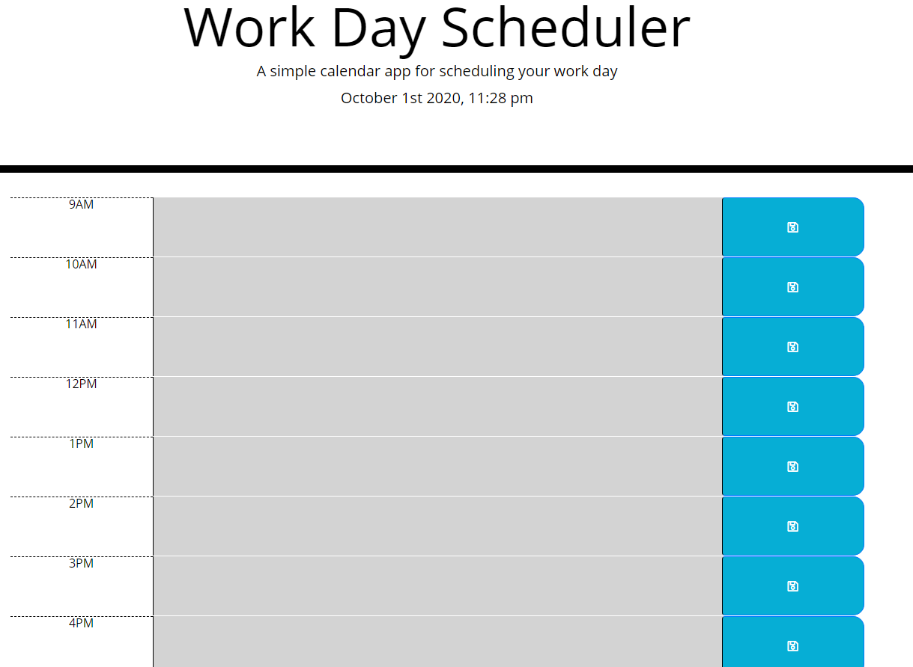
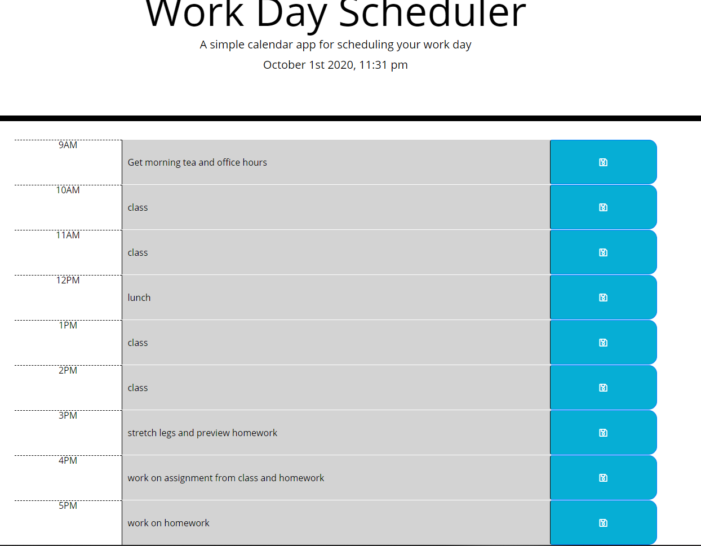

# Work_Day_Scheduler

## Description
The employer has a busy schedule and needed a daily planner which would allow them to manager their time more effectively. The user can add important events within the input boxes alligned to the each work hour and save. The save allows for the user to refreash the page or revisit the page and the information they entered will still be there within local storage. The time will also update each refreash to the minute. Once the page refreshed to a new hour the schedule will update with grayed out sections as past, red as current hour, and green as future events and times.

If you would like to demo the scheduler itself here is the link [Work_Day_Scheduler](https://zach-greenberg.github.io/Work_Day_Scheduler/)

## Table of Contents

* [What I Learned](#Learned)
* [Pictures and Link](#Extra)

## Learned

This project pushed my knowldge of how to generate a grid formation and creation from the javascript only. This kept the code from repeating itself within the HTML file and will save time in the future if the work hours are ever extended or retrackted.

I was able to practice and implement accessing information from another website and including it within my code. For this application it was the up to date time that is kept at the top of the page.

Within javascript, the code worked in a way where it generated id's with unique tags for each generated row and columns. This allowed myself to call individual components if needed instead of calling a class or entire container.

## Extra

